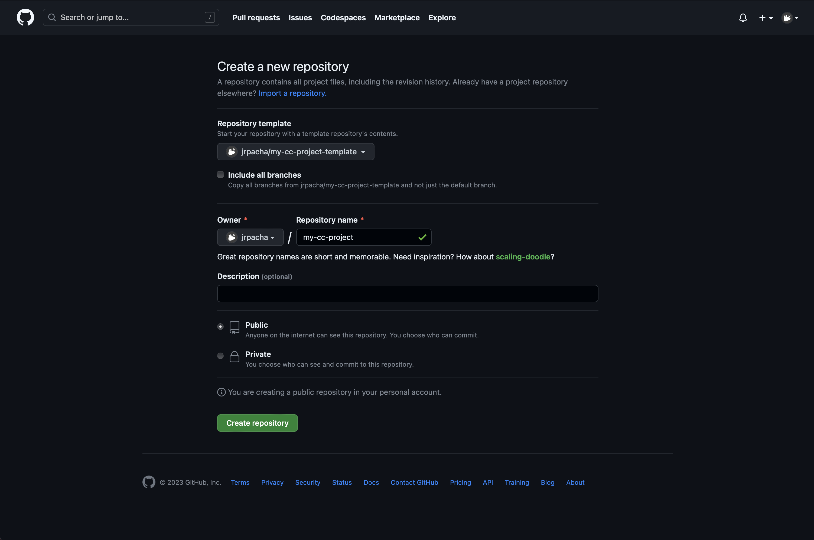

# Template for C/C++
You can create a github repository for your project using this template, then
clone it to your local machine, add all your stuff and push it back to 
[github.com](https://www.github.com).

- First, in [github.com](htpps://www.github.com), create a _repo_ for your project
using this template. 

From now on, I assume this is already done and you have
named your project as `my-cc-project`.

- Then, clone the repo to some local folder in your machine. To fix ideas,
let's clone it in the directory <tt>Desktop</tt> of your _local_ user account,
```bash
~ $ cd Desktop
~ Desktop$ git clone git@github.com:jrpacha/my-project
~ Desktop/ cd my-cc-project
~ Desktop/my-cc-project$ 
```
- Place your source files (<tt>.c</tt>/<tt>.cc</tt>) in the folder <tt>src</tt>. For example:
```bash
~ Desktop/my-project$ ls src
main.cc    message.cc
```
- Place your header files (<tt>.h</tt>/<tt>.hh</tt>) in folder 
<tt>include</tt>. For example:
```bash
~ Desktop/my-project$ ls include
message.hh
```
- Use `make` to build the program. This creates a new directory,
<tt>bin</tt> and builds the project's executable file in it. The executable
file is created with the same name as the project's folder,
```bash
~ Desktop/my-cc-project$ make
c++ -g -O0 -W -fPIC -MMD -MP -MF .d/main.Td  -Iinclude -c src/main.cc -o.o/main.o
mv -f .d/main.Td .d/main.d
c++ -g -O0 -W -fPIC -MMD -MP -MF .d/message.Td  -Iinclude -c src/message.cc -o.o/message.o
mv -f .d/message.Td .d/message.d
c++ -o bin/my-cc-project .o/main.o .o/message.o

bin/my-cc-project created.
```
- To run the program,
```bash
~ Desktop/my-cc-project$ ./bin/my-cc-project
my_project: template for my projects in FORTRAN77/C/C++
See README.md for more information.
```
- Alternatively `make run` runs the program as well,
```bash
~ Desktop/my-cc-project$ make run
my_project: template for my projects in FORTRAN77/C/C++
See README.md for more information.
```
- `make clean` clears object and dependence files, actually what it does is
to delete the folders <tt>.o</tt> and <tt>.d</tt>, and all its content,
i.e.,
```bash
~ Desktop/my-cc-project$ make clean
rm -f .o/*.o .d/*.d
rmdir .o .d >/dev/null
```
- `make mrproper` removes also the <tt>bin</tt> directory that held the
executable file,
```bash
~ Desktop/my-project$ make mrproper
rm -f .o/*.o .d/*.d
rmdir .o .d >/dev/null
rm -f bin/*
rmdir bin >/dev/null
```
- Optional (but convenient): replace this <tt>README.md</tt> with a new one with a
description of your project.
- Stage the changes you have made to your project,
 commit them and push your repo to [github.com](htts://www.github.comCreate a git repo and push it to [github.com](https://www.github.com)
```bash
~ Desktop/my-cc-project$ git status
On branch main
Your branch is up to date with 'origin/main'.

Changes not staged for commit:
  (use "git add <file>..." to update what will be committed)
  (use "git restore <file>..." to discard changes in working directory)
	modified:   README.md
	modified:   include/message.hh
	modified:   src/main.cc
	modified:   src/message.cc

~ Desktop/my-cc-project$ git add .
~ Desktop/my-cc-project$ git status
On branch main
Your branch is up to date with 'origin/main'.

Changes to be committed:
  (use "git restore --staged <file>..." to unstage)
	modified:   README.md
	modified:   include/message.hh
	modified:   src/main.cc
	modified:   src/message.cc
``` 
- Then commit the changes
```bash
~ Desktop/my-cc-project$ git commit -m "1st commit of my-cc-project"
main 1967aba] 1st commit of my-cc-project
 4 files changed, 7 insertions(+), 6 deletions(-)

~ Desktop/my-cc-project$ git status
git status                                                                ─╯
On branch main
Your branch is ahead of 'origin/main' by 1 commit.
  (use "git push" to publish your local commits)

nothing to commit, working tree clean
```
- Finally push the changes to your remote repo in [github.com](www.github.com) 
```bash
Enumerating objects: 15, done.
Counting objects: 100% (15/15), done.
Delta compression using up to 8 threads
Compressing objects: 100% (7/7), done.
Writing objects: 100% (8/8), 643 bytes | 643.00 KiB/s, done.
Total 8 (delta 5), reused 0 (delta 0), pack-reused 0
remote: Resolving deltas: 100% (5/5), completed with 5 local objects.
To github.com:jrpacha/my-cc-project.git
   cd5573e..1967aba  main -> main
```
### References
- [GNU Make. A program for Directing
Recompilation](https://make.mad-scientist.net/papers/advanced-auto-dependency-generation). 
- [Generating Prerequisites Automatically](https://www.gnu.org/software/make/manual/html_node/Automatic-Prerequisites.html),
section 4.14 of the [GNU Make
Manual](https://www.gnu.org/software/make/manual/) at
[gnu.org](www.gnu.org).
- [Practical Makefiles, by
example](http://nuclear.mutantstargoat.com/articles/make/) by John
Tsiombikas <a
href="mailto:nuclear@member.fsf.org">nuclear@member.fs.org</a>. I wrote
the `Makefile` in this template following sections 5 and 6 of this document.
